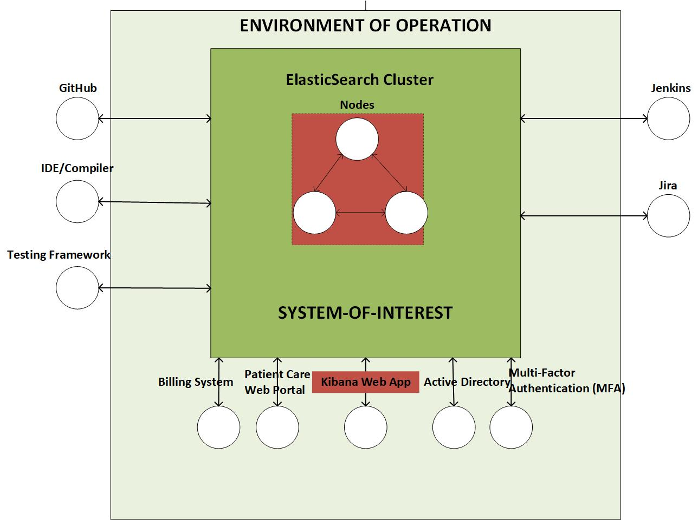

# CYBR 8420 - Project Proposal
# Open-Source Project: Elastic Stack  
## Team pubilc repository
[Elastic_Search_repository](https://github.com/zijunmei/Software_Assurance)

## 1. Hypothetical Operational Environment (Zijun)

Data is an important company asset, and different viewers should only be able to search for data that meets his permission level. Enterprise-level search supports comprehensive permission management configuration of data sources to meet enterprises' data security browsing needs.  

Let's say a hospital is seeking a technology capable of enterprise-level search engines for building their system based on PII/HIPAA rules. They require the search engine to be able to adjust the search results based on the visitor's search privileges. For example, a visitor with security level 1 will not be able to access information with a security level higher than 1. So the search engine would only return information for level 1 and obscure the higher level information and rank it by relevance. This need effectively protects the patient's personally identifiable information as well as other important information(such as Protected health information) from being easily compromised.  

Elastic Search provides permission and access control feature which just satisfy the reqiurement described above. Elasticsearch restricts search behavior by predetermining access attributes (including levels) for files, ensuring that files and information are presented only to visitors of the appropriate level.

### 1.1 Systems Engineering View (Mustapha) 
   
    
### 1.2 Perceived Threats (Mustapha)
(Here should be the description of the Perceived Threats)  
  
    

### 1.3 List of Security Features (Zijun)
- Permisson and access control
    - Ensure proper visibility results and information based on pre-determined access attributes known as document-level permissions
- Preventing unauthorized access
    - Provide a standalone authentication mechanism that enables users to quickly password-protect their cluster.
- Preserving the integrity of user's data
    - TLS is used to protect the integrity of users' data from tampering and also to provide confidentiality by encrypting communications within the cluster.
- Maintaining an audit trail
    - A feature is provided to log access information and design audit levels to help monitor system conditions as well as help diagnose operational problems.

  

## 2. Motivation of the Project (Zijun)
During the planning phase of the project, our team agreed after discussion that we needed to ensure that our project was acceptable to each of us. That is, the selected project should ideally meet our technical preferences, interest preferences, and knowledge background. The reality was that after careful research we found that it is difficult to find a project which could meet the preferences of all members. Therefore, after the first meeting we decided that everyone should look for two or three projects that they were interested in and vote on the final project at the second meeting.

At the second meeting we proposed 8 projects, and after discussion we eliminated 5 of them. We finally decided to ask for Dr. Gandhi's advice with these three projects. In the end we chose Elastic Search as our open source software. First of all, this open source software has a wide variety of application scenarios as a search engine. Correspondingly, it also has a very developed open source community. The developer documentation is also complete, and the security features are clear. Although we are not familiar with this software, we can easily find information about this software on the web (tutorials, technical principles, architecture, etc.). This will help us to start the rest of the project.

## 3. Description of the Open-Source Project (Jeremy)

Description

## 4. Licensing Information of Elastic Search (Jeremy)
    
    License 
    
## 5. Contribution and Agreements (Charlie)

## 6. Security Related History of Elastic Search (Charlie)
  
## 7. Reflection (Mustapha)
  
    
